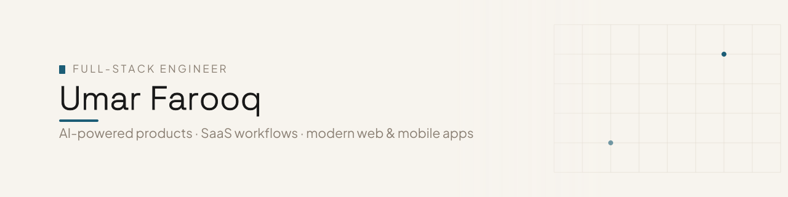

  

# Umar Farooq

Full-Stack Engineer helping startups build AI-powered products, SaaS workflows, internal tools, and modern web/mobile apps.

I work across frontend, backend, mobile, and product delivery to turn scoped product ideas into production-ready systems. My focus is building software that is clear, useful, scalable, and aligned with real business needs.

## What I build

- AI-powered product workflows
- SaaS platforms and internal tools
- Modern web applications
- Mobile apps with Flutter
- Product-focused full-stack systems

## Work I can walk through

- **FormPilot AI** — AI-assisted intake and workflow product, packaged as a flagship private case study.
- **Resumi** — private resume-focused product work for creating and presenting polished professional profiles.
- **Invoicery** — private client-management and invoicing workflow product for business operations.

Some product work is private, so I discuss it through sanitized walkthroughs, case-study notes, and controlled demos rather than public source links.

## Core stack

`React` `Next.js` `TypeScript` `Node.js` `Flutter` `Tailwind CSS` `PostgreSQL` `Prisma` `Sanity` `OpenAI`

## Current focus

I am most interested in working with startup founders and product teams building AI-powered products, internal tools, SaaS workflows, and modern customer-facing platforms.

## Links

- **LinkedIn:** [linkedin.com/in/mumar20](https://www.linkedin.com/in/mumar20/)
- **Book intro call:** [cal.com/umar-farooq-gqime0](https://cal.com/umar-farooq-gqime0)
