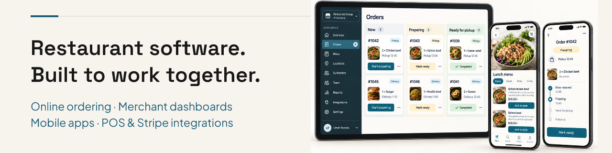

  

# Umar Farooq

**Restaurant ordering, POS integrations & SaaS engineering**

I build and repair ordering apps, merchant dashboards, POS integrations and practical AI features for restaurant software teams, and websites with online ordering for restaurant owners.

At Crave since May 2020, I progressed to Director of Engineering while remaining hands-on. My work spans customer ordering, merchant operations, mobile apps, shared services and Square/Clover integration engineering.

## Selected restaurant work

- **[CraveUp](https://mumar.dev/case/craveup-restaurant-platform?utm_source=github)** — employer contribution across customer ordering, merchant dashboards, React Native staff workflows, shared Node.js services and Square/Clover integrations. Team-built platform; private source.
- **[Multi-Location Restaurant Ordering](https://mumar.dev/case/restaurant-ordering-platform?utm_source=github)** — client delivery through Crave; brand withheld. Flutter, web/admin, Express services, loyalty and provider webhooks. Crave publicly describes the engagement as a guest app for an 80-location restaurant brand; my case explains my specific contribution.
- **[Nomly — AI Operations Copilot](https://mumar.dev/case/ai-ops-copilot?utm_source=github)** — [Crave's AI assistant for restaurant operators](https://nomly.ai/). I helped build the 2025 foundation for document/email retrieval, agent workflows and voice. POS context uses a separate integration layer. The product has evolved since; the case is scoped to that foundation.
- **[Quick Food](https://mumar.dev/case/quick-food?utm_source=github)** — owned ordering sandbox. My contribution includes product direction, checkout hardening, deployment fixes and responsive QA. [Try the sandbox](https://quick-food.mumar.dev/); it is not a client-results claim.

Most professional source is private. The case studies explain my role and show public/demo captures or sanitized diagrams, with their evidence boundaries.

## Open source

I contribute to Crave's open-source restaurant tooling:

- **[Loyalty Interchange Protocol](https://github.com/craveup-oss/loyalty-interchange-protocol)** — public contributor work on restaurant loyalty interoperability.
- **[CraveJS Storefront SDK for Dart](https://github.com/craveup-oss/cravejs-storefront-sdk-dart)** — public contributor work on the Dart storefront SDK.

These are organization projects; I do not claim sole authorship. **[StudyAI](https://github.com/mumar20/studyai)** is separate product-leadership proof: I owned direction, acceptance criteria and review; the project team implemented it.

`Next.js` · `React` · `TypeScript` · `Node.js` · `PostgreSQL` · `Flutter` · `React Native`

## Work with me

For an unclear production problem, start with a paid read-only audit and written repair plan. For a defined feature or integration, agree one milestone with acceptance checks, relevant tests and a reviewable handoff. Remote from Pakistan (UTC+5), with availability and overlap agreed for each project.

[Selected work](https://mumar.dev/work?utm_source=github) · [LinkedIn](https://www.linkedin.com/in/mumar20/) · [Discuss a project](https://mumar.dev/?utm_source=github#contact)

For non-restaurant websites and commerce, [Hassan leads that work](https://mumar.dev/business-websites?utm_source=github).
